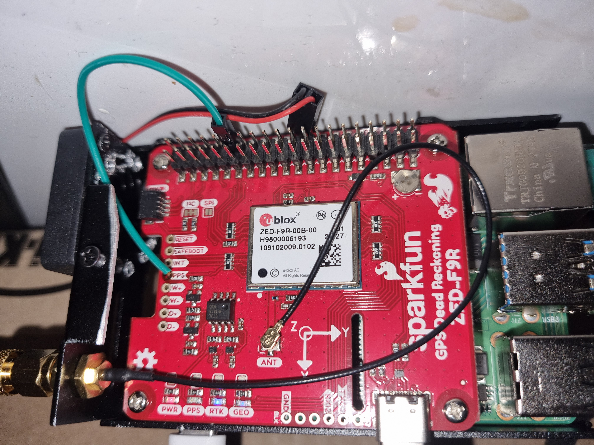
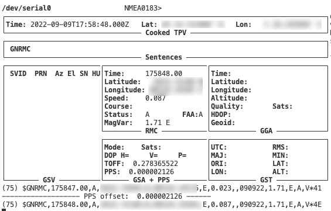
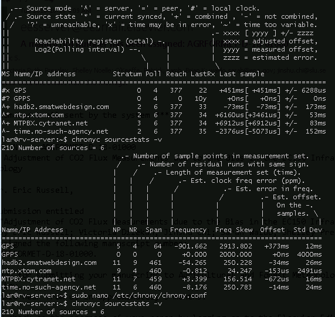
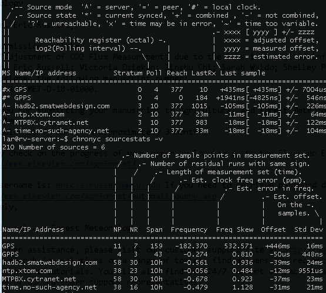

# Rasbian NTP Server

- [Rasbian NTP Server](#rasbian-ntp-server)
  - [Introduction](#introduction)
  - [Materials](#materials)
  - [Assembly](#assembly)
  - [Software Setup](#software-setup)
    - [Enable serial port](#enable-serial-port)
    - [Enable required kernel modules](#enable-required-kernel-modules)
    - [Test the GPS connection](#test-the-gps-connection)
    - [Remove DHCP hook](#remove-dhcp-hook)
    - [Install `gpsd`](#install-gpsd)
    - [Install `chrony`](#install-chrony)
    - [Configure `gpsd`](#configure-gpsd)
    - [Configure `chrony`](#configure-chrony)
  - [Fine Tuning](#fine-tuning)
  - [Serving time to clients](#serving-time-to-clients)
  - [Enable standalone mode](#enable-standalone-mode)
    - [References](#references)

## Introduction

First of all, big thanks to [Patrick O'Keeffe](https://github.com/patricktokeeffe/rpi-ntp-server)for the base of this fork.

Why do we need a dedicated guide for U-blox ZED-F9R? I ran into some pitfalls when trying to use the original guide, and have updated it accordingly. The main difference is the way the configuration of the GNSS-receiver takes place. In this guide, setup of baud rate and configuration of messages is done with `systemd` before and after the startup of `gpsd`

In the end, this guide will end in a Stratum 1 NTP server using U-blox ZED-F9R GNSS receiver & Raspberry Pi.

## Materials

Substitutions may apply. Your mileage may vary. Additional equipment
required for setup (i.e. keyboard, mouse, monitor).

- Raspberry Pi (Pi Zero not recommended)
  - a quality micro SD card (class 10 recommended)
  - a quality power supply
  - a case (to protect, and dampen temperature fluctuations)
- [SparkFun GPS-RTK Dead Reckoning pHAT for Raspberry Pi](https://www.sparkfun.com/products/16475?_ga=2.146295924.1923577196.1662707414-633814070.1662707414)
  - SMA to uFL/u.FL/IPX/IPEX RF Adapter Cable
  - GPS Antenna, External, Active, 3-5V 28dB 5m SMA
- Soldering iron
- Dupoint female connector

## Assembly

Assembling the ZED-F9R pHAT is as easy as stacking it on top of the Raspberry Pi GPIO comb, but in order to get the PPS-signal, some smaller modifications needs to be done.
Solder a wire with a dupoint-female plug on, from the PPS-output and connect to [pin12_GPIO18](https://pinout.xyz/pinout/pin12_gpio18). In the picture below, this is shown with the green wire.



## Software Setup

The latest version of this project is based on [Raspberry Pi OS Lite](https://www.raspberrypi.com/software/operating-systems/#raspberry-pi-os-64-bit)
with `chrony` and `gpsd`.

### Enable serial port

The stock configuration for Raspberry Pi Model 4 hardware is to present a login over
the hardware serial port, and to use the hardware uart to support Bluetooth connections
To enable the hardware serial port for use with the GPS receiver, first disable the login:

```bash
sudo raspi-config
```

```raspi-config
Interfacing Options > Serial
```

- Would you like a login shell to be accessible over serial? **No**
- Would you like the serial port hardware to be enabled? **Yes**

### Enable required kernel modules

```bash
sudo nano /boot/config.txt
```

```diff
 ...
+
+# Reclaim hardware UART for hardware serial port
+dtoverlay=pi3-miniuart-bt
+
+## pps-gpio
+##     Enable kernel support for GPS receiver pulse-per-second (PPS) input
+dtoverlay=pps-gpio
```

```bash
sudo reboot
```

### Test the GPS connection

First, the serial port data stream:

```bash
sudo cat /dev/serial0
```

If this gives a lot of rubish text on the screen, no worries, it probably works fine and it's only a matter of changing baud rate which will be done in [Configure `gpsd`](#configure-gpsd).

> Ensure a good GNSS fix and check that the PPS-light blinks every one second. This indicates that the GNSS-receiver has sufficient with satelites to give a good timestamp.

Start by installing the `pps-tools` and test that you are getting a new line every one second.

```bash
sudo apt-get install pps-tools -y
```

```bash
sudo ppstest /dev/pps0
```

```stdout
trying PPS source "/dev/pps0"
found PPS source "/dev/pps0"
ok, found 1 source(s), now start fetching data...
source 0 - assert 1455208600.181885044, sequence: 480 - clear  0.000000000, sequence: 0
source 0 - assert 1455208601.265220834, sequence: 481 - clear  0.000000000, sequence: 0
source 0 - assert 1455208602.348548499, sequence: 482 - clear  0.000000000, sequence: 0
```

### Remove DHCP hook

To prevent the Pi from getting NTP configuration from any DHCP
servers, remove `ntp-servers` from the end of the `request` block:

```bash
sudo nano /etc/dhcp/dhclient.conf
```

```diff
 ...
 request subnet-mask, broadcast-address, time-offset, routers,
         ...
-        rfc3442-classless-static-routes, ntp-servers;
+        rfc3442-classless-static-routes;
 ...
```

### Install `gpsd`

```bash
sudo apt-get install gpsd gpsd-clients -y
```

### Install `chrony`

In latest versions of Raspbian, *ntp* is replaced by a client-only
*systemd* NTP implementation. When installing `chrony`, this client is disable automatically

```bash
sudo apt-get install chrony -y
```

### Configure `gpsd`

Update config file with the receiver and PPS-signal:

```bash
sudo nano /etc/default/gpsd
```

```diff
-DEVICES=""
+DEVICES="/dev/serial0 /etc/pps0"

 # Other options you want to pass to gpsd
-GPSD_OPTIONS=""
+GPSD_OPTIONS="-n"

 # if having several receivers connected that you don't want to use with gpsd, comment this one out:
-USBAUTO="true"
+#USBAUTO="true"
```

Since the ZED-F9Rs serial interface is default set to a baud rate of `38400`, it needs to be specified before attaching the receiver to `gpsd`. This is easiest done by running `stty` in `systemd` before starting `gpsd.service`:

```bash
sudo nano /etc/systemd/system/gpsd.service
```

Add the following content:

```ini
[Unit]
Description=GPS (Global Positioning System) Daemon
Requires=gpsd.socket
# Needed with chrony SOCK refclock
After=chronyd.service

[Service]
# set up serial0 with baud rate 38400 
ExecStartPre=/usr/bin/stty -F /dev/serial0 speed 38400 parodd
EnvironmentFile=-/etc/default/gpsd
EnvironmentFile=-/etc/sysconfig/gpsd
ExecStart=/usr/sbin/gpsd -N $GPSD_OPTIONS $DEVICES
ExecStartPost=/bin/sleep 2
# Disable all NMEA messages from the device
ExecStartPost=/usr/bin/ubxtool -d NMEA --device /dev/serial0
ExecStartPost=/bin/sleep 2
# Enable the bare minimum of message, the NMEA RMC message
ExecStartPost=/usr/bin/ubxtool -z CFG-MSGOUT-NMEA_ID_RMC_UART1,1 --device /dev/serial0
ExecStartPost=/bin/sleep 2
# Disable all ubx messages
ExecStartPost=/usr/bin/ubxtool -d BINARY --device /dev/serial0

[Install]
WantedBy=multi-user.target
Also=gpsd.socket
```

After updating the `systemd` file for `gpsd.service`

```bash
sudo systemctl daemon-reload
sudo reboot
```

When the Raspberry pi is up and running again, test it with:

```bash
gpsmon
```

Something like this should show:



If this for some reason doesn't work, start by looking in the logs of `systemd` for the `gpsd.service`:

```bash
systemctl status gpsd.service 
```

### Configure `chrony`

And configure for use with GPS device:

```bash
sudo nano /etc/chrony/chrony.conf
```

```diff
+# Add PPS:
+refclock SHM 0 offset 0 delay 0 refid GPS noselect
+refclock SOCK /run/chrony.pps0.sock lock GPS refid GPPS
 pool 2.debian.pool.ntp.org iburst
```

> From the [`chrony.conf` docs](https://chrony.tuxfamily.org/doc/4.0/chrony.conf.html):
>  
> - `refclock` specifies a hardware reference clock
>   - `SHM` is the shared memory driver, which is utilized by *gpsd*
>   - `PPS` is for pulse-per-second signals, read from `/dev/pps0`
>   - `SOCK` is a UNIX domain socket, similar to SHM
>  
> - `lock` is used to link PPS samples to another *refclock*
>
> - `noselect` is an optional flag used to signal the GPS shouldn't be used directly
>
> - `refid` is the tracking label, "GPPS" indicates a PPS-enabled GPS source
>
> - `offset` and `delay` are values which will be tuned after running overnight

At this point, test the time synchronization using:

- `chronyc tracking`
- `chronyc sources -v`
- `chronyc sourcestats -v`

If necessary, apply a step-change to system clock:
> The `-a` argument is required in older versions of *chronyc* to prevent an error.

```bash
sudo chronyc -a makestep
```

Immediately after starting, the sources may not provide a good
time signal:



After running overnight, with a good GPS signal, you should
obtain a lock to the *GPPS* refclock:



## Fine Tuning

After warming up, the **GPS** refclock showed an **Offset** value
consistently between 400-500ms, generally on the higher end.
This value can be incorporated directly to improve the source:

```bash
sudo nano /etc/chrony/chrony.conf
```

```diff
-refclock SHM 0 offset 0 delay 0 refid GPS noselect
+refclock SHM 0 offset 0 delay 0.5 refid GPS noselect
 refclock PPS /dev/pps0 lock GPS refid GPPS
```

Although recommended, the `makestep` directive is not included in the
default *chrony* configuration file. Manually add it:

```bash
sudo nano /etc/chrony/chrony.conf
```

```diff
 ...
+# Step the clock, if necessary, for a short window after starting
+#
+
+makestep 1 5
```

## Serving time to clients

Finally, to enable this device as an NTP server, add `allow` directives
to `/etc/chrony/chrony.conf` as appropriate. See the [user
documentation](https://chrony.tuxfamily.org/doc/3.4/chrony.conf.html)
for more details.

Example, to permit all clients from local subnet 192.168.1.x:

```bash
sudo nano /etc/chrony/chrony.conf
```

```diff
 ...
 # This directive designates subnets (or nodes) from which NTP clients are allowed
 # to access to `chronyd'.

+# allow everyone on home network
+allow 192.168.1.0/24

 #allow foo.example.net
 #allow 10/8
 ...
```

## Enable standalone mode

In case the server loses GPS and Internet access, but network
clients are still attempting to sync, use the local hardware
clock as a last resort source:

```bash
sudo nano /etc/chrony/chrony.conf
```

```diff
-#local stratum 10
+local stratum 10
```

### References

- <https://powersj.github.io/post/ubuntu-bionic-chrony/>

- <https://spellfoundry.com/2016/05/29/configuring-gpio-serial-port-raspbian-jessie-including-pi-3/>

- <https://chrony.tuxfamily.org/doc/3.4/chrony.conf.html>

- <http://robotsforroboticists.com/chrony-gps-for-time-synchronization/>
- <https://gpsd.gitlab.io/gpsd/gpsd-time-service-howto.html>
- <https://gpsd.io/ubxtool-examples.html>
- <https://gpsd.io/troubleshooting.html>
